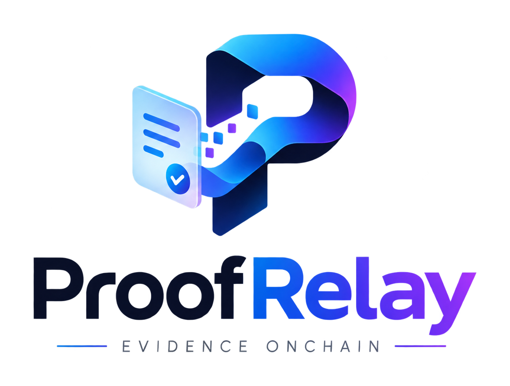

<p align="center">
  
</p>

<p align="center"><em>An onchain evidence market for AI claims, on 0G.</em></p>

You post a claim and a bounty. Independent verifiers fetch the same snapshotted
sources, build a claim–evidence graph, and commit their answers before any of
them can see another's. 0G Storage holds the artifacts, 0G Compute runs the
verification, and a contract on 0G Chain settles it — paying on agreement and
withholding on conflict.

ProofRelay does not claim to know the truth. It makes the basis of an answer
inspectable: which bytes were read, when they were read, which model read them,
what each verifier concluded, and where they disagreed.

## Live deployment

| | |
|---|---|
| Contract | [`0x486Dc550792889B102ef0c2Cf984526628C39D0E`](https://chainscan-galileo.0g.ai/address/0x486Dc550792889B102ef0c2Cf984526628C39D0E) |
| Chain | 0G Galileo testnet, chain ID **16602** |
| Deploy block | `52792094` — the indexer starts here, not at genesis |
| Storage | 0G Storage via `indexer-storage-testnet-turbo.0g.ai` |

`npm run verify-abi` proves the TypeScript client, the Solidity source and the
deployed bytecode all agree. The check that settles it is byte equality: the live
runtime is the same 19,775 bytes this source compiles to, so the deployment runs
exactly this code — not merely an interface that looks like it. On top of that it
checks 45 function selectors and 17 event topics read from real logs.

## Quick start

```bash
npm install
npm run build

npm run wallets          # generate a key per role into .env (safe to re-run)
# fund the printed operator address at https://faucet.0g.ai
npm run fund             # spread gas from the operator to the role wallets

createdb proofrelay
npm run migrate
npm run doctor           # tells you exactly what is still wrong

npm run dev              # API + 2 verifiers + adjudicator + web, one terminal
npm run seed             # post three real tasks so the UI has something to show
```

`npm run doctor` is the one to reach for when something is off. It checks the
chain, the contract, every role wallet's balance, the verifier allow-list, 0G
Storage, 0G Compute and the database, and names the command that fixes each
problem.

## Deploying your own

The contract above is live and the whole stack works against it unchanged, so a
deployment is optional. To deploy your own:

```bash
bash scripts/deploy.sh                  # simulate against whatever CHAIN_ID names
npm run deploy                          # broadcast
npm run approve-verifiers               # grant roles, approve the two verifiers
```

The script refuses to run against the wrong chain, refuses an unfunded deployer,
and runs all 169 contract tests before broadcasting.

Read off real receipts, not estimated. Both 0G networks settle at a 4 gwei
effective gas price, so these are the mainnet numbers too:

| | gas | 0G |
|---|---|---|
| Deploy the contract | 4,691,007 | 0.018764 |
| `createTask` | 249,809 | 0.000999 |
| `commitReport` | 151,065 | 0.000604 |
| `revealReport` | 183,246 | 0.000733 |
| `finalizeConsensus` | 161,472 | 0.000646 |
| `finalizeTask` | 34,488 | 0.000138 |
| `registerVerifier` | 172,396 | 0.000690 |
| One object into 0G Storage | — | 0.001182 |

A full two-verifier task therefore costs the creator about 0.001 0G plus its
bounty, each verifier about 0.0014 0G, the keeper about 0.0008 0G, and the
storage key 0.0012 0G per artifact it writes — up to 21 on one `prepare`. All of
it fits inside a single faucet drip on Galileo; on mainnet it is the same figure
in 0G, bought rather than dripped.

See [`docs/DEPLOYMENT.md`](docs/DEPLOYMENT.md) for what Galileo does differently
(a 2 gwei minimum tip, and receipts that lag block production — both handled).

## What is in here

```
contracts/          ProofRelay.sol + 169 Foundry tests (unit, negative, fuzz, invariant)
packages/
  schemas/          canonical JSON, the six artifact schemas, task enums, API DTOs
  chain-client/     the verified ABI, viem client, taskId and commitment encodings
  storage-adapter/  0G Storage and a filesystem mirror behind one interface
  compute-adapter/  0G Compute Router, the broker path, and a deterministic engine
  consensus/        the agreement rule: verdict, evidence coverage, evidence overlap
  config/           env loading with the precedence the deployment doc documents
apps/api/           HTTP API, chain indexer, orchestrator, keeper
workers/
  verifier/         builds reports, commits, reveals
  adjudicator/      second-pass review of a challenged task
proofrelay-frontend/  the Evidence Ledger web UI
infra/              docker-compose, Dockerfiles, migrations
docs/               PRD, architecture, deployment, runbook, threat model
```

## How integrity actually works

The contract stores a hash; 0G Storage stores the bytes. The pointer only helps
retrieval — it is never the integrity mechanism, because a 0G root hash is a
merkle root over sectors and not a function you can check a JSON document
against.

Every artifact is serialised canonically (sorted keys, minified) and addressed
by `keccak256` of those bytes. Nothing is trusted on the way in: the verifier
hash-checks the manifest before reading it, hash-checks each snapshot against
the manifest's record of it, and the API re-checks a report's hash before
showing it. A mismatch is surfaced as `CONTENT_HASH_MISMATCH`, never smoothed
over — that condition is exactly what the hash exists to detect.

```bash
npm run check:artifact   # fetch a live task's manifest from 0G Storage and
                         # rehash it against what the contract stores
npm run check:lifecycle  # cancel, challenge, adjudicate and expire, on chain
npm run check:api        # every HTTP route, including the ones that refuse
```

## The parts that are deliberately not automatic

- **Verifiers are an allow-list.** A worker self-registers, but an admin must
  approve it before it can commit. An open verifier market needs stake,
  reputation and an anti-collusion story; that is post-MVP, and pretending
  otherwise would be the wrong kind of demo.
- **Disagreement is not averaged away.** Two verifiers who disagree do not
  produce a blended confidence — the task does not settle in full, and the UI
  shows the split.
- **Compute failure is never verification.** A task is never marked verified
  because a model timed out. The job retries, then fails, and the task stays
  where it was.

## Status

| | |
|---|---|
| Contract | 169 Solidity tests, 443 TypeScript tests; deployed bytecode is byte-for-byte the code in this repo |
| 0G Storage | live — upload, download and hash round-trip verified on Galileo |
| 0G Chain | live — the running system settled a task on its own: escrow, two commits, two reveals, consensus, finalization and withdrawal, with no operator step |
| 0G Compute | live — reports are scored on the testnet router by a TEE-attested provider (TeeTLS over Intel TDX, verified by dstack). Every report records the provider address, the model, and whether the router affirmed attestation for that response. Without a key a verifier falls back to the local deterministic engine and says so in the trace |
| Read model | live — rebuilt from the deployment block, every manifest fetched from 0G Storage and hash-checked |

[`docs/VERIFICATION.md`](docs/VERIFICATION.md) has the commands and their real
output for each of these, including what is *not* verified.

Testnet only. Public data only. Not investment, medical, legal or credit advice.
