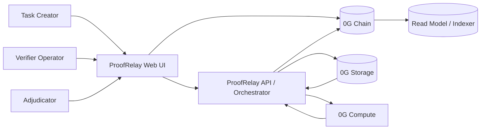
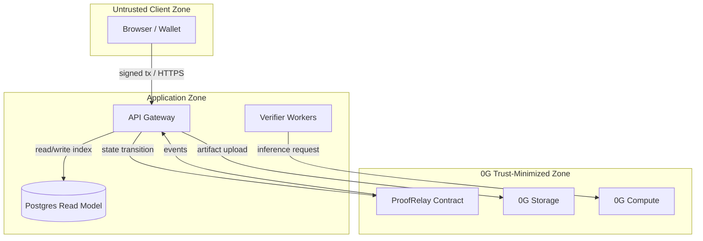
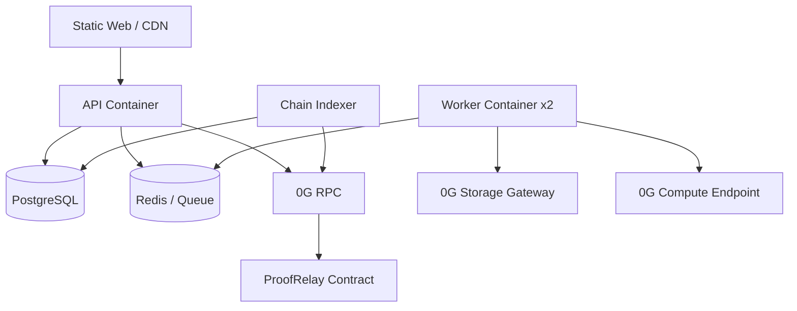

# ProofRelay — Technical Architecture

**Versi:** 1.0 MVP

**Status:** Draft siap implementasi

**Tanggal:** 31 Agustus 2026

## 1. Tujuan arsitektur

Dokumen ini mendefinisikan arsitektur ProofRelay sebagai dApp yang menggabungkan frontend web, backend orchestration, verifier workers, 0G Storage, 0G Compute, dan smart contract pada 0G Chain. Desain berfokus pada tiga properti: **integrity**, **reproducibility**, dan **settlement transparency**.

Arsitektur menggunakan prinsip `onchain minimum, offchain scalable`. Smart contract menyimpan state settlement, commitment, hash, pointer, status, dan payment. Data besar seperti dokumen snapshot, evidence graph, prompt metadata, dan report lengkap disimpan di 0G Storage. Compute-heavy inference, extraction, retrieval, dan scoring dijalankan melalui 0G Compute.

## 2. Context diagram



## 3. Logical architecture

| Layer | Komponen | Tanggung jawab |
|---|---|---|
| Presentation | Web app | Wallet connection, task creation, evidence graph, status, settlement. |
| Application | API gateway, task service, verifier service, dispute service | Validasi request, orchestration, idempotency, authorization. |
| Compute | Verifier workers, source fetcher, claim extractor, evidence scorer | Menghasilkan report dan verdict. |
| Storage | 0G Storage adapter, manifest store, artifact store | Menyimpan snapshot, report, metadata, dan manifest. |
| Blockchain | ProofRelay contract, event listener, transaction relayer | Escrow, commitment/reveal, finalization, payout, attestation. |
| Read model | Indexer/cache | Menyediakan query cepat tanpa membaca seluruh chain pada setiap page load. |
| Operations | Logs, metrics, tracing, secrets | Reliability, debugging, rate limiting, key management. |

## 4. Recommended technology stack

| Area | Pilihan MVP | Catatan |
|---|---|---|
| Frontend | React + TypeScript + Vite atau Next.js | Gunakan wagmi/viem untuk EVM interaction. |
| Backend | Node.js + TypeScript + Fastify/NestJS | API modular dan mudah diuji. |
| Contract | Solidity + Foundry | Minimal surface; unit dan invariant tests. |
| Storage | 0G Storage SDK | Adapter terpisah agar mudah diganti pada test harness. |
| Compute | 0G Compute SDK/API | Worker orchestration dengan timeout dan retry. |
| Queue | Redis/BullMQ atau database-backed queue | Satu job per verifier/task. |
| Database | PostgreSQL | Read model, job state, request logs, non-canonical metadata. |
| Object schema | JSON Schema | Evidence dan manifest harus versioned. |
| Deployment | Docker Compose untuk demo; managed service untuk API | Jangan mengandalkan local process pada hari demo. |
| Monitoring | OpenTelemetry + Prometheus-compatible metrics | Correlate task ID dan tx hash. |

Pilihan stack dapat disederhanakan menjadi Vite, Node.js, Foundry, PostgreSQL, dan Docker Compose untuk submission hackathon. 0G tetap menjadi source of truth untuk artifacts dan smart contract state; database hanya berfungsi sebagai index dan job coordinator.

## 5. Trust boundaries



Asumsi trust penting: browser tidak dipercaya, API dapat mengalami compromise, worker dapat menghasilkan output salah, dan database dapat kehilangan data. Karena itu, integrity-critical state harus dapat diverifikasi dari chain dan content hash. Operator key tidak boleh dapat memindahkan escrow tanpa mematuhi state machine.

## 6. End-to-end task flow

### 6.1 Create task

1. Browser meminta `POST /v1/tasks/prepare` dengan task specification.
2. API melakukan schema validation dan content safety check.
3. API mengambil source publik, menyimpan snapshot ke 0G Storage, dan menghasilkan `manifestHash`.
4. Browser memanggil `createTask` pada contract dengan bounty, verifier count, deadline, rule ID, dan manifest pointer/hash.
5. API mengamati event `TaskCreated`, melakukan indexing, dan mengubah status menjadi `OPEN`.

### 6.2 Commit/reveal verification

1. Worker mengambil task berstatus `OPEN` melalui queue.
2. Worker mengunduh manifest dan snapshot dari 0G Storage.
3. Worker memanggil 0G Compute untuk claim extraction dan evidence scoring.
4. Worker membuat `report.json`, menghitung `reportHash`, dan mengunggah report ke 0G Storage.
5. Worker menghasilkan `commitment = keccak256(taskId, verifier, reportHash, salt)`.
6. Worker memanggil `commitReport(taskId, commitment)`.
7. Setelah commit phase berakhir, worker memanggil `revealReport(taskId, reportPointer, reportHash, salt)`.
8. Contract memverifikasi commitment dan memancarkan `ReportRevealed`.

### 6.3 Consensus and settlement

1. API/indexer mengambil semua revealed reports.
2. Consensus engine menghitung agreement per claim berdasarkan verdict dan evidence overlap.
3. Jika rule terpenuhi, API/authorized keeper memanggil `finalizeConsensus`.
4. Jika challenge diajukan, contract menahan payout dan status berubah menjadi `DISPUTED`.
5. Adjudicator mengunggah adjudication report ke 0G Storage dan memanggil `resolveDispute`.
6. Setelah finalized, verifier dapat memanggil `claimReward`; creator dapat memanggil refund bila kondisi refund terpenuhi.

## 7. Smart-contract architecture

### 7.1 Contract modules

| Modul | Tanggung jawab |
|---|---|
| `ProofRelayCore` | Task registry, state machine, task parameters, lifecycle. |
| `EscrowVault` | Menahan bounty, verifier reward, challenger bond, refund. |
| `VerifierRegistry` | Menyimpan verifier address, metadata hash, active status, optional stake. |
| `DisputeModule` | Challenge, bond, adjudication pointer, outcome. |
| `AttestationModule` | Menyimpan final result hash dan compact attestation. |

Untuk MVP, modul dapat digabung menjadi satu contract `ProofRelay` agar deployment dan debugging lebih sederhana. Pemisahan logis tetap dipertahankan melalui internal libraries dan role boundaries.

### 7.2 Core data structures

```solidity
struct Task {
    address creator;
    uint96 bounty;
    uint32 verifierCount;
    uint32 commitDeadline;
    uint32 revealDeadline;
    uint32 disputeDeadline;
    bytes32 manifestHash;
    string manifestPointer;
    bytes32 ruleId;
    TaskStatus status;
    uint32 reportCount;
}

struct ReportCommitment {
    address verifier;
    bytes32 commitment;
    bool revealed;
    bytes32 reportHash;
    string reportPointer;
}

struct Dispute {
    address challenger;
    uint96 bond;
    bytes32 evidenceHash;
    string evidencePointer;
    bool resolved;
}
```

Pointer string tidak boleh menjadi satu-satunya integrity mechanism. Contract harus menyimpan hash; pointer hanya membantu retrieval. Jika pointer berubah atau gateway tidak tersedia, client masih dapat mendeteksi mismatch melalui hash.

### 7.3 Contract functions

| Fungsi | Caller | Efek |
|---|---|---|
| `createTask` | Creator | Membuat task dan mengunci bounty. |
| `cancelTask` | Creator | Membatalkan task sebelum verifier commit sesuai rule. |
| `commitReport` | Registered verifier | Mengunci commitment. |
| `revealReport` | Committed verifier | Membuka report pointer/hash/salt. |
| `openChallenge` | Creator/verifier | Mengunci challenge bond dan evidence pointer. |
| `finalizeConsensus` | Keeper/anyone | Menetapkan result jika rule terpenuhi. |
| `resolveDispute` | Adjudicator role | Menetapkan outcome dan distribusi bond. |
| `claimReward` | Verifier | Menarik reward setelah finalisasi. |
| `refundCreator` | Creator | Mengambil refund jika task gagal sesuai rule. |
| `registerVerifier` | Verifier | Mendaftarkan verifier metadata/stake. |
| `pause`/`unpause` | Multisig admin | Emergency stop terbatas. |

### 7.4 Events

```solidity
event TaskCreated(
    bytes32 indexed taskId,
    address indexed creator,
    uint256 bounty,
    bytes32 manifestHash,
    bytes32 ruleId
);

event ReportCommitted(
    bytes32 indexed taskId,
    address indexed verifier,
    bytes32 commitment
);

event ReportRevealed(
    bytes32 indexed taskId,
    address indexed verifier,
    bytes32 reportHash,
    string reportPointer
);

event ChallengeOpened(
    bytes32 indexed taskId,
    address indexed challenger,
    bytes32 evidenceHash
);

event TaskFinalized(
    bytes32 indexed taskId,
    bytes32 resultHash,
    uint8 outcome
);

event RewardClaimed(
    bytes32 indexed taskId,
    address indexed verifier,
    uint256 amount
);
```

## 8. Consensus engine

Consensus tidak boleh hanya membandingkan string jawaban. Engine MVP mengevaluasi tiga dimensi: verdict label, evidence source overlap, dan evidence quality. Setiap claim memiliki label `SUPPORTED`, `CONTRADICTED`, atau `INSUFFICIENT_EVIDENCE`. Agreement tercapai bila minimal dua verifier memberikan label sama dan evidence pointer mereka menunjuk ke snapshot yang sama atau compatible.

```text
claimAgreement =
    sameVerdict >= requiredAgreement
    AND evidenceCoverage >= minimumEvidenceCoverage
    AND noCriticalConflict
```

Untuk demo, `requiredAgreement = 2 of 2` dan `minimumEvidenceCoverage = 0.8`. Jika kedua verifier memberi label berbeda, task tidak difinalisasi otomatis. Rule ID disimpan pada task agar hasil dapat direproduksi dan rule baru dapat ditambahkan tanpa mengubah report lama.

## 9. Offchain services

### 9.1 API Gateway

API menerima request dari frontend, melakukan authentication berbasis wallet signature, rate limiting, schema validation, dan idempotency. API tidak boleh memutuskan settlement secara sepihak. Ia hanya menyiapkan artifacts, mengorkestrasi workers, dan memanggil transaksi yang telah diizinkan oleh contract state.

Endpoint inti:

| Method | Endpoint | Fungsi |
|---|---|---|
| `POST` | `/v1/auth/nonce` | Membuat nonce untuk wallet signature. |
| `POST` | `/v1/auth/verify` | Memverifikasi signature dan membuat session. |
| `POST` | `/v1/tasks/prepare` | Menyiapkan manifest dan source snapshots. |
| `GET` | `/v1/tasks` | Mengambil daftar task dari read model. |
| `GET` | `/v1/tasks/{taskId}` | Mengambil status task dan report pointers. |
| `POST` | `/v1/tasks/{taskId}/sync` | Memicu sinkronisasi event chain. |
| `POST` | `/v1/tasks/{taskId}/challenge` | Menyiapkan evidence challenge. |
| `GET` | `/v1/reports/{reportHash}` | Mengambil report tervalidasi dari storage. |
| `GET` | `/health` | Health dan dependency status. |

### 9.2 Orchestrator

Orchestrator mengelola job state berikut: `SOURCE_SNAPSHOT`, `MANIFEST_UPLOAD`, `VERIFIER_DISPATCH`, `COMMIT_SUBMISSION`, `REVEAL_SUBMISSION`, `CONSENSUS_EVALUATION`, `FINALIZATION`, dan `NOTIFICATION`. Setiap job memiliki `attempt`, `nextRetryAt`, `lastErrorCode`, dan `idempotencyKey`.

### 9.3 Verifier worker

Worker menerima task manifest, memanggil 0G Compute, menghasilkan report terstruktur, dan mengunggah artifact ke 0G Storage. Worker harus bekerja deterministic sejauh mungkin: temperature rendah, model ID eksplisit, prompt version, source snapshot hash, dan output schema wajib dicatat.

Pseudo-flow:

```text
load task manifest
verify manifest hash
load source snapshots
extract claims
for each claim:
    retrieve relevant spans
    run entailment / contradiction scoring on 0G Compute
    produce verdict and confidence
assemble report
hash report
upload report to 0G Storage
submit commitment onchain
wait for reveal phase
submit reveal onchain
```

## 10. Storage design

### 10.1 Object types

| Object | Isi | Visibility |
|---|---|---|
| `source-snapshot` | URL, retrieved bytes/text, headers, timestamp, content hash | Public demo |
| `task-manifest` | Task specification, source pointers, rule ID, schema version | Public |
| `verifier-report` | Claims, evidence, verdict, model metadata, reasoning summary | Public demo |
| `challenge-evidence` | Evidence tambahan dan alasan challenge | Public demo |
| `adjudication-report` | Hasil second-pass dan decision reason | Public |
| `private-input` | Data privat yang hanya direpresentasikan oleh hash pada MVP | Tidak digunakan untuk demo |

### 10.2 Content addressing

Setiap object diserialisasi secara canonical JSON sebelum hashing. Field dengan urutan tidak stabil harus diurutkan. Hash yang digunakan di contract dihitung atas canonical bytes, bukan atas tampilan UI. Object metadata wajib memiliki `schemaVersion`, `createdAt`, `producer`, dan `contentHash`.

## 11. 0G Compute integration

0G Compute dipakai untuk pekerjaan yang tidak efisien atau tidak tepat dilakukan di smart contract: claim extraction, source retrieval ranking, entailment classification, contradiction detection, dan confidence calibration. Contract hanya menerima compact result hash dan settlement state.

Compute adapter harus memiliki interface berikut:

```typescript
interface ComputeAdapter {
  runClaimExtraction(input: ClaimExtractionInput): Promise<ComputeResult>;
  scoreEvidence(input: EvidenceScoringInput): Promise<ComputeResult>;
  health(): Promise<DependencyHealth>;
}
```

`ComputeResult` minimal memiliki `requestId`, `modelId`, `pipelineVersion`, `inputHash`, `outputHash`, `latencyMs`, dan `rawArtifactPointer`. Jika Compute gagal, worker melakukan retry maksimal tiga kali. Setelah itu job berstatus `FAILED_RETRYABLE` atau `FAILED_FINAL`, dan task tidak boleh otomatis dianggap verified.

## 12. 0G Chain interaction

Frontend melakukan transaksi pengguna langsung melalui wallet untuk `createTask`, `openChallenge`, dan `claimReward`. Backend keeper dapat mengirim transaksi lifecycle yang aman untuk publik, seperti `finalizeConsensus`, setelah memeriksa deadline dan report state. Untuk MVP, keeper key harus memiliki saldo terbatas dan tidak memiliki fungsi withdrawal admin.

Indexer mendengarkan event contract, menyimpan block number, transaction hash, log index, dan decoded payload. Event processing harus idempotent dengan key `(chainId, txHash, logIndex)`. Reorg handling dilakukan dengan menunggu sejumlah confirmation sebelum menandai state final pada read model.

## 13. Database schema read model

```sql
CREATE TABLE tasks (
  task_id BYTEA PRIMARY KEY,
  creator TEXT NOT NULL,
  status TEXT NOT NULL,
  bounty NUMERIC NOT NULL,
  manifest_hash TEXT NOT NULL,
  manifest_pointer TEXT NOT NULL,
  rule_id TEXT NOT NULL,
  created_block BIGINT,
  tx_hash TEXT,
  created_at TIMESTAMPTZ NOT NULL,
  updated_at TIMESTAMPTZ NOT NULL
);

CREATE TABLE reports (
  id BIGSERIAL PRIMARY KEY,
  task_id BYTEA NOT NULL REFERENCES tasks(task_id),
  verifier TEXT NOT NULL,
  commitment TEXT NOT NULL,
  report_hash TEXT,
  report_pointer TEXT,
  status TEXT NOT NULL,
  model_id TEXT,
  pipeline_version TEXT,
  tx_hash TEXT,
  created_at TIMESTAMPTZ NOT NULL,
  UNIQUE(task_id, verifier)
);

CREATE TABLE jobs (
  id BIGSERIAL PRIMARY KEY,
  idempotency_key TEXT UNIQUE NOT NULL,
  task_id BYTEA,
  job_type TEXT NOT NULL,
  status TEXT NOT NULL,
  attempts INT NOT NULL DEFAULT 0,
  last_error_code TEXT,
  next_retry_at TIMESTAMPTZ,
  created_at TIMESTAMPTZ NOT NULL,
  updated_at TIMESTAMPTZ NOT NULL
);
```

Database tidak boleh dipakai untuk menentukan final truth jika berbeda dengan event chain. Jika terdapat conflict antara database dan chain, UI menampilkan status `SYNC_REQUIRED` dan indexer melakukan replay.

## 14. API security

Authentication menggunakan SIWE-style wallet signature dengan nonce sekali pakai dan expiry pendek. Session token tidak boleh memuat private key. Semua mutation endpoint wajib memiliki `Idempotency-Key`. Input URL dibatasi pada HTTP/HTTPS dan diproses melalui SSRF-safe fetcher yang memblokir private IP ranges, localhost, file scheme, dan internal metadata endpoints.

Rate limit diterapkan per wallet, IP, dan task. Upload dibatasi ukuran dan MIME type. HTML/script dari source snapshot disanitasi sebelum ditampilkan. Verifier output diperlakukan sebagai data tidak tepercaya dan divalidasi dengan JSON Schema.

## 15. Smart-contract security

Kontrak harus menggunakan checks-effects-interactions, pull payment untuk reward, reentrancy guard, integer bounds, custom errors, dan explicit deadline checks. Tidak boleh ada arbitrary external call dari contract. Admin pause tidak boleh mencuri escrow; pause hanya menghentikan create/commit/reveal baru sesuai emergency policy.

Test minimum:

| Kelas test | Contoh |
|---|---|
| Unit | Task creation, commitment matching, payout, refund. |
| Negative | Reveal salah, deadline terlewati, double claim, duplicate challenge. |
| State invariant | Bounty contract balance selalu ≥ total liabilitas task. |
| Fuzz | Random verifier count, amount, timestamp, report hash. |
| Integration | Contract event → indexer → UI status. |
| Failure | Storage unavailable, Compute timeout, reverted transaction. |

## 16. Key management

Wallet pengguna tetap berada pada browser wallet. Server hanya memiliki tiga jenis key: deployer/admin multisig, keeper key dengan saldo kecil, dan optional verifier key untuk demo. Secret disimpan pada environment secret manager; tidak dicatat di logs. Setiap transaction request memiliki `requestId`, signer role, gas estimate, dan confirmation count.

## 17. Observability

Metric minimum: `task_created_total`, `task_completed_total`, `compute_request_latency_ms`, `storage_upload_latency_ms`, `verifier_commit_total`, `verifier_reveal_total`, `dispute_opened_total`, `payout_total`, `job_retry_total`, dan `chain_sync_lag_blocks`. Semua log memakai structured JSON dan field `taskId`, `requestId`, `verifierId`, `txHash`, serta `errorCode`.

Alert minimum: chain RPC unavailable, indexer lag lebih dari 20 blocks, Compute error rate di atas 10%, Storage error rate di atas 10%, queue backlog di atas threshold, dan contract balance lebih kecil daripada liability estimate.

## 18. Deployment topology



Untuk hackathon demo, semua service dapat dijalankan dengan Docker Compose kecuali 0G endpoints. Production candidate perlu memisahkan API dan worker, menggunakan managed PostgreSQL, secret manager, automatic backups, dan deployment yang memiliki rollback.

## 19. Disaster recovery

Canonical data berada di chain dan 0G Storage. Database read model dapat dibangun ulang dari chain events dan storage pointers. Backup PostgreSQL dilakukan harian untuk operational convenience, tetapi pemulihan utama tidak boleh bergantung pada database backup. Jika gateway storage down, sistem mencoba gateway alternatif atau menampilkan pointer/hash dan status unavailable.

## 20. Threat model

| Threat | Mitigasi |
|---|---|
| Malicious verifier mengirim report palsu | Commitment/reveal, evidence hash, stake/slashing fase lanjut. |
| Creator membuat task berbahaya | Public-data-only policy, content safety checks, moderation flag. |
| Source poisoning | Snapshot, multi-source evidence, source reputation hanya sebagai signal. |
| Frontend menampilkan data palsu | UI mengambil canonical hash/status dari indexer dan menyediakan raw JSON. |
| API compromise | API tidak memiliki arbitrary withdrawal; contract membatasi state transition. |
| Sybil challenge | Challenge bond dan rate limit. |
| Replay signature | Nonce, expiry, chain ID, domain separation. |
| SSRF melalui URL source | Safe fetcher dan network egress restriction. |
| DoS melalui task besar | Size limits, quotas, queue priority, per-wallet rate limit. |

## 21. Privacy model

MVP hanya menerima dokumen dan URL publik. Untuk data privat, frontend harus menunjukkan warning dan hanya menyimpan encrypted artifact atau hash pointer; namun private data workflow bukan bagian dari acceptance criteria MVP. Fase lanjut dapat menggunakan encrypted storage, access grants, dan confidential compute/TEE apabila primitive resmi 0G yang sesuai telah divalidasi.

## 22. Repository structure

```text
proofrelay/
├── apps/
│   ├── web/
│   └── api/
├── packages/
│   ├── schemas/
│   ├── consensus/
│   ├── storage-adapter/
│   ├── compute-adapter/
│   └── chain-client/
├── contracts/
│   ├── src/ProofRelay.sol
│   ├── test/
│   └── script/
├── workers/
│   ├── verifier-a/
│   ├── verifier-b/
│   └── adjudicator/
├── infra/
│   ├── docker-compose.yml
│   └── migrations/
├── docs/
│   ├── PRD.md
│   ├── ARCHITECTURE.md
│   └── threat-model.md
└── README.md
```

## 23. Implementation sequence

Tahap pertama menyiapkan contract skeleton, network configuration, canonical schemas, dan seeded public documents. Tahap kedua mengimplementasikan task creation, manifest upload, dan escrow. Tahap ketiga menambahkan worker A/B, 0G Compute adapter, report upload, serta commitment/reveal. Tahap keempat mengimplementasikan consensus, dispute, dan payout. Tahap terakhir berisi test, seeded demo, architecture walkthrough, video, dan deployment runbook.

## 24. Definition of done teknis

Arsitektur dianggap siap untuk demo apabila contract ter-deploy pada target network, chain ID dan addresses terdokumentasi, satu task dapat dibuat dari UI, manifest serta report dapat ditemukan di 0G Storage, minimal satu Compute call berhasil, dua verifier menghasilkan output, hash dapat diverifikasi, conflict dapat ditampilkan, payout/refund dapat diuji, dan seluruh failure path utama memiliki pesan yang dapat dipahami.

## 25. Referensi

[1]: [0G Documentation — Understanding 0G](https://docs.0g.ai/introduction/understanding-0g)

[2]: [0G Documentation](https://docs.0g.ai/)

[3]: [0G Bridge by AKINDO](https://app.akindo.io/wave-hacks/Z4MlX4vreI72ol6pd?tab=submissions)

[4]: [0G Ecosystem Growth Program](https://0g.ai/blog/0g-ecosystem-program)
